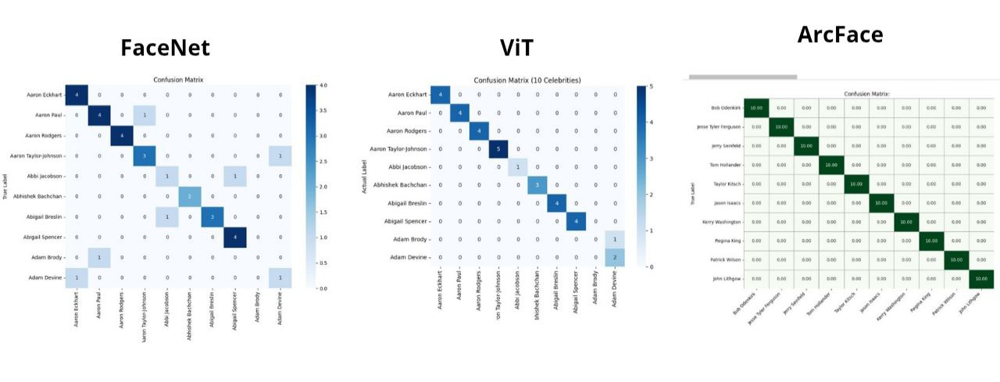
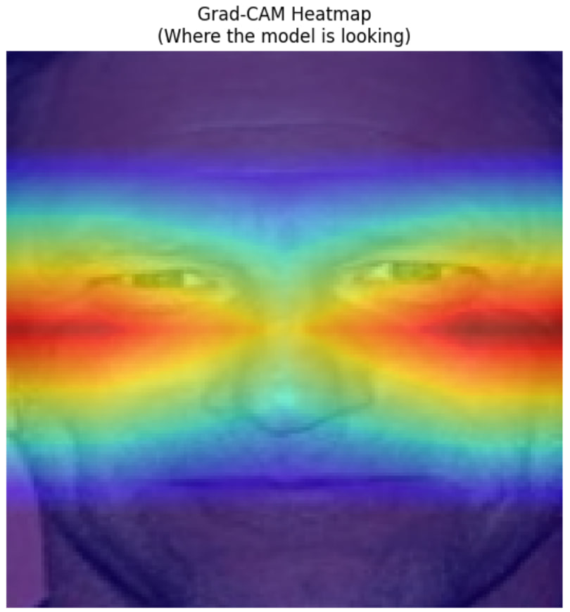
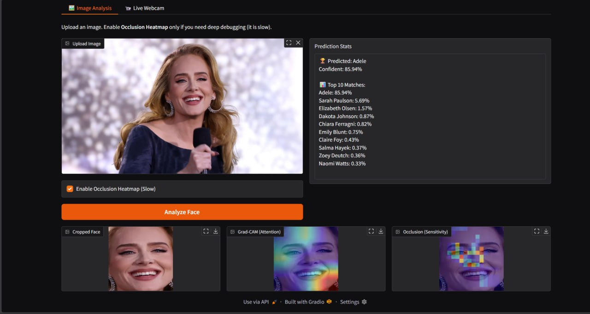
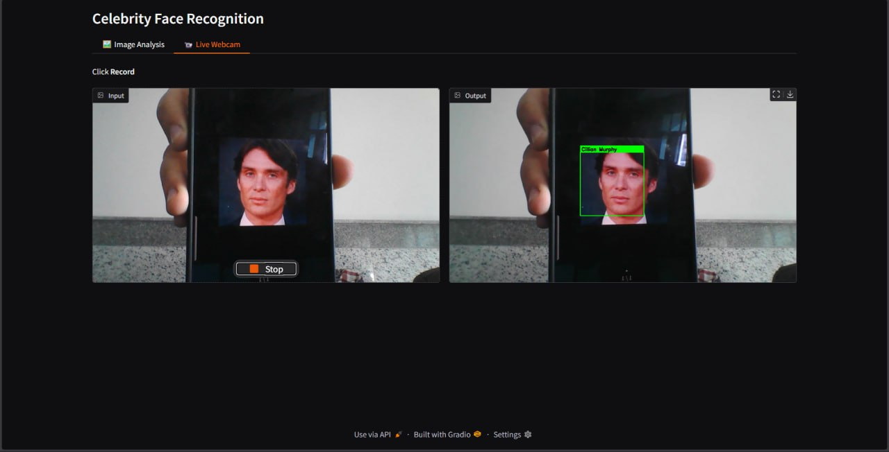

# AI-Skills-Project-Celebrity-Classification-Models

## **Introduction**
Project Objective is to deploy a **Deep Learning** model using **CNNs** and **Transfer Learning** to Recognize celebrity identities from facial images.
_This is a team project. Refer to [Credits](#credits)._

---

## **Model Development**
### Used Pretraind Models:
- `FaceNet` ⟶  pretrained **CNN** trained on large-scale face datasets.
- `ViT` ⟶ a **Vision Transformer** pretrained on ImageNet-21K.
- `ArcFace` ⟶ pretrained **CNN** trained on large-scale face datasetes with additive angular margin.

### Trainging Dataset:
- Top 1000 celebrities Images with different angles and positions.
- 18,184 images.
- 256x256 size.
> [Dataset on HuggingFace](https://huggingface.co/datasets/tonyassi/celebrity-1000/)
### Data preprocessing:
- Resized each image in the dataset to fit the expected size for the model _(e.g. (160,160,3) for FaceNet)_.
- Splitted the data into _Train_, _Test_ and _Evaluation_ sets.
### Embedding Extraction:
- Used the pretrained models to get **Face Embeddings** for the dataset and save it into files _(.csv,.npy)_ for faster access.
### Classifier Design:
- Input layer that matches the size of the embedding.
- Hidden Fully Connected layers.
- Output layer that uses **softmax** activation function for classification.
### Classifier Training:
- Trained classifiers on the embeddings in the _Training_ set and used celebreties names as a target for a number of epoches.

## **Model Evaluation**
- We evaluated each model's performance and compared the performance between them.  
- Used metrics:

  |           |  Accuracy |  Precision    | Recall |
  | :----------:|:------------------:|:------------------------:|:----------------------------:|
    | **FaceNet**|  $97\%$	| $95\%$ | $97\%$     |  
    | **ViT**|  $81\%$	| $79\%$ | $79\%$     |  
    | **ArcFace**| $96\%$	                    | $95\%$                       | $95\%$       |

- Used **Confusion Matrix**:

  

## **Explainability**
- Used **`Grad-Cam`** to  interpret models predictions.

    

## **GUI**
- Used `Gradio` to make a functional GUI to apply the `FaceNet` Model.
    
### Webcam:
- Added Webcam option for **Real-time Classificatioin**.  
    

---

## **Credits**
[**`Yousef Medhat`**](https://www.linkedin.com/in/yousef-medhat-7293232a1/)  
[**`Yousef Waheed`**](https://www.linkedin.com/in/youssef-waheed-8462061a7/)  
[**`Ali Abdou`**](https://www.linkedin.com/in/ali-abdouu/)  
[**`Amira Azzam`**](https://www.linkedin.com/in/amira-azzam2510/)  
[**`Mavi Refaat`**](https://www.linkedin.com/in/mavi-refaat-96372b2b5)  
[**`Nouran Hassan`**](https://www.linkedin.com/in/nouran-hassan112/)  

## **License**
This project is open source and available under the [MIT License](https://mit-license.org/).
